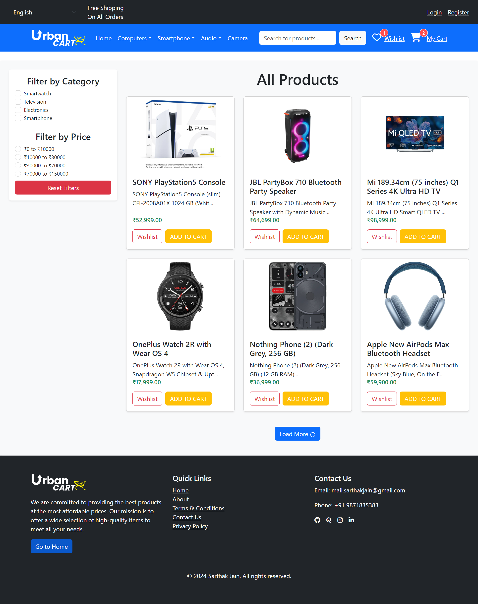
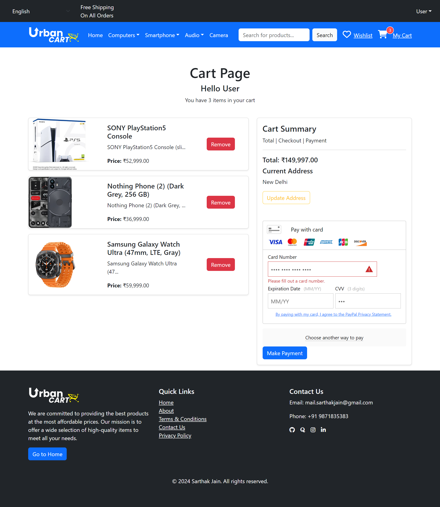

# Urban Cart - Full Stack E-commerce Web Application 🛍️

Urban Cart is a React-based full-stack e-commerce web application that provides users with a seamless shopping experience. Built using the MERN stack, it includes features like product browsing, cart management, filtering, and admin functionalities for managing products and categories.

## Features ✨
- **User Authentication:** Register, login, and logout functionality.
- **Admin & User Dashboards:** Separate interfaces for admins and users.
- **Product and Category CRUD:** Admin can create, update, and delete products and categories.
- **Filters:** Filter products by category or price.
- **Shopping Cart:** Add items to the cart, adjust quantities, and proceed to checkout.
- **Checkout Process:** Secure and streamlined checkout process for a smooth purchase experience.
- **Order History:** View your past orders with details.
- **Responsive Design:** Built using Bootstrap and FontAwesome for styling and icons.

## Live Demo 🌐
Check out the live demo: [UrbanCart - Ecommerce Store](https://urbancart-store.netlify.app/)

## Tech Stack 💻
- **Frontend:** React.js, Bootstrap, FontAwesome
- **Backend:** Node.js, Express.js
- **Database:** MongoDB
- **Authentication:** JWT for user sessions
- **Deployment:** Netlify (Frontend), Render (Backend)

## Prerequisites 🔧
- Node.js
- MongoDB

## Installation 🛠️

1. **Clone the repository:**
   ```bash
   git clone https://github.com/the-sarthak-jain/UrbanCart-Ecommerce-Store.git

2. **Navigate to the project directory:**
   ```bash
   cd UrbanCart-Ecommerce-Store
   ```

3. **Install dependencies:**

   For the frontend:
   ```bash
   cd client
   npm install
   ```

   For the backend:
   ```bash
   cd ../server
   npm install
   ```

4. **Environment Variables:**
   Create a `config.env` file in the `server` directory and add the following:
   ```env
   PORT=8080
   JWT_SECRET=MYNAMEISSARTHAKJAIN
   MONGO_URL=mongodb+srv://<username>:<password>@cluster0.vzsyypy.mongodb.net/Ecommerce?retryWrites=true&w=majority&appName=Cluster0
   BRAINTREE_MERCHANT_ID=Your_BrainTree_MerchantID
   BRAINTREE_PUBLIC_KEY=Your_BrainTree_PublicKey
   BRAINTREE_PRIVATE_KEY=Your_BrainTree_PrivateKey
   ```

5. **Run the Application:**

   To start the frontend:
   ```bash
   cd client
   npm start
   ```

   To start the backend:
   ```bash
   cd server
   nodemon app.js
   ```

6. **Open the app** at `http://localhost:3000` (frontend) and `http://localhost:8080` (backend).

## Project Structure 📂

- **client/**: React frontend
  - `src/`: Contains all React components, routes, and styles
- **server/**: Node.js backend
  - `app.js`: Main application file
  - `controllers/`: Contains controller logic for products, categories, etc.
  - `models/`: MongoDB models
  - `routes/`: API routes
  - `config.env`: Contains Environment Variables

## Screenshots 🖼️
- **Homepage:**


- **Product Detail Page:**


- **Wishlist Page:**


- **Cart Page:**


- **Orders Page:**


- **User Profile - User Dashboard:**


- **Create Category - Admin Dashboard:**


- **Create Products - Admin Dashboard:**


- **All Products - Admin Dashboard:**


- **Edit Product - Admin Dashboard:**


- **Login Form:**


## Usage 🛒
- **Homepage:** Displays products and allows users to filter by category or price.
- **Admin Dashboard:** Manage products and categories. Requires admin login.
- **Shopping Cart:** Add products to your cart and adjust quantities.

## Common Issues & Fixes 🔧
- **JWT Expiry:** If tokens expire quickly, check the expiration time in the auth middleware.
- **Connection Errors:** Ensure MongoDB is properly connected by checking the `MONGO_URL` in your `config.env`.
- **CORS Issues:** Set up appropriate headers on the server if CORS issues are experienced between the client and server.

## Contribution 🛠️
Contributions are welcome! Feel free to open issues or submit pull requests for improvements or bug fixes.

---
## Contact

For any inquiries or support, please contact [Sarthak Jain](mailto:mail.sarthakjain@gmail.com).

Thank you for checking out Urban Cart! If you have any questions or suggestions, feel free to reach out.
